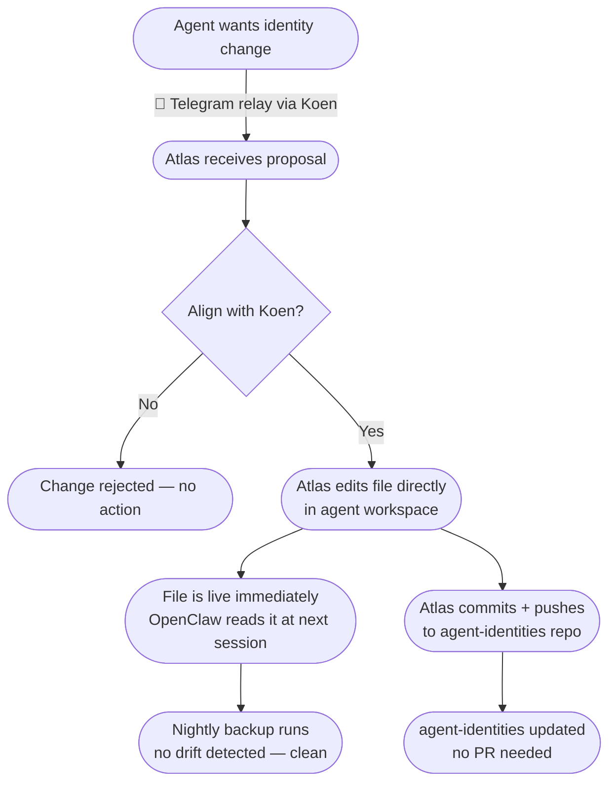
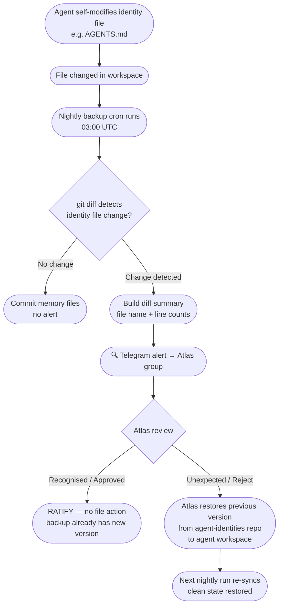
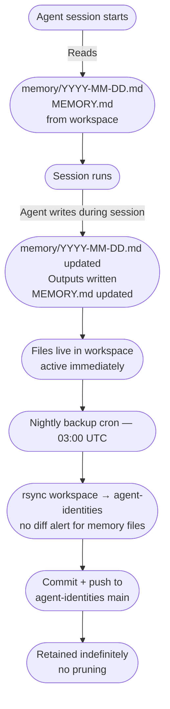
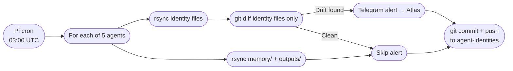
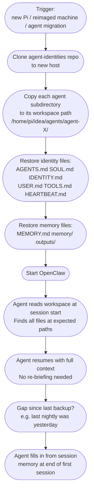

# Agent Identity & Memory Architecture

**Status:** Proposed  
**Author:** Atlas  
**Date:** 2026-04-01  

---

## Problem

Agent repos currently carry three conceptually distinct layers under one Git roof:

| Layer | Examples | Should live in |
|-------|----------|----------------|
| **Code** | source files, tests, scripts, docs | agent code repo (main-protected) |
| **Identity** | AGENTS.md, SOUL.md, IDENTITY.md, USER.md, TOOLS.md, HEARTBEAT.md | governed separately — Atlas only |
| **Memory** | MEMORY.md, memory/, outputs/ | agent-owned, backed up continuously |

Mixing all three in a branch-protected code repo creates friction:
- Memory and output files require PR ceremony to persist (memory/updates → main)
- Identity changes are governed by the same PR flow as code changes — slow and heavyweight
- There is no drift detection: an agent can silently rewrite its own AGENTS.md

## Design Principles

1. **Live-first.** Files are active the moment they are written to the agent workspace. No PR required for memory to persist.
2. **Backup for reproducibility.** A single `agent-identities` repo on GitHub provides a restore point for re-hosting or recovery.
3. **Atlas governs identity.** Identity file changes are authorised only by Atlas (after aligning with Koen). Unauthorized drift is flagged automatically.
4. **Agents own memory.** Memory files are written freely by agents during sessions. They are backed up silently — no approval loop.
5. **Separation of concerns.** Agent code repos become pure code: source, tests, design docs. Nothing else.

---

## File Classification

### Identity files (Atlas-governed)
Files that define who an agent is and how it behaves. Changes require Atlas authorisation.

```
AGENTS.md       — role definition, boot sequence, memory protocol
SOUL.md         — personality, tone, values
IDENTITY.md     — name, creature, emoji, role summary
USER.md         — notes about the human the agent works with
TOOLS.md        — environment, API endpoints, tooling conventions
HEARTBEAT.md    — periodic task config
```

### Memory files (agent-governed)
Files written by the agent during normal operation. No approval required.

```
MEMORY.md                    — long-term persistent facts (cross-session reference)
memory/YYYY-MM-DD.md         — daily session log
outputs/YYYY-MM-DD-HHMM-*.md — substantive response archive
```

---

## Repository Structure

All identity and memory files are backed up to a single GitHub repo: **`agent-identities`**.

```
agent-identities/
  README.md
  agent-operations-manager/
    AGENTS.md
    SOUL.md
    IDENTITY.md
    USER.md
    TOOLS.md
    HEARTBEAT.md
    MEMORY.md
    memory/
      2026-04-01.md
      ...
    outputs/
      2026-04-01-0900-topic.md
      ...
  agent-engine-dev/
    ...
  agent-console-dev/
    ...
  agent-site-dev/
    ...
  agent-programme-manager/
    ...
```

- **Not branch-protected** — Atlas pushes directly, no PR ceremony
- **Main branch only** — no feature branches, no PRs
- **Append-only in practice** — memory and output files accumulate; identity files are updated in-place

Agent code repos (agent-operations-manager, agent-engine-dev, etc.) add the following to `.gitignore`:

```
# Identity files — backed up to agent-identities repo
AGENTS.md
SOUL.md
IDENTITY.md
USER.md
TOOLS.md
HEARTBEAT.md
MEMORY.md

# Memory files — backed up to agent-identities repo
memory/
outputs/
```

OpenClaw config paths are **unchanged** — files continue to live at the same workspace paths. The code repo simply stops tracking them.

---

## MEMORY.md — All Agents

All five agents maintain a `MEMORY.md` at their workspace root. This is the long-term persistent fact store: things that should be available at every session start without reading through months of daily logs.

Typical contents:
- Board IDs, API tokens, repo paths
- Key architectural decisions
- Constraints and conventions established with Koen
- Open items with enough context to resume

**MEMORY.md is a memory file** (agent-governed): agents update it themselves during sessions, and the nightly backup captures it. It is subject to drift detection only if it diverges in ways that look like identity manipulation — which in practice will not happen.

Each agent's boot sequence (Every Session section in AGENTS.md) adds a final step:

> Read `MEMORY.md` — long-term persistent facts

---

## Nightly Backup Cron

A Pi cron job runs at **03:00 UTC daily** and executes `/home/pi/idea/scripts/backup-agent-identities.sh`.

The script:
1. For each agent workspace, `rsync` all identity + memory files into the corresponding `agent-identities/agent-X/` subdir
2. Run `git diff --name-only` before staging — isolate identity file changes from memory/output changes
3. If any **identity files** changed → build a Telegram alert and send to Atlas's group
4. Commit all changes + push to `agent-identities` on GitHub

### Script skeleton

```bash
#!/bin/bash
set -euo pipefail

WORKSPACE="/home/pi/idea/agents"
BACKUP_REPO="/home/pi/agent-identities"
BOT_TOKEN="$(jq -r '.channels.telegram.botToken' /root/.openclaw/openclaw.json)"
ATLAS_CHAT="-5105695997"

IDENTITY_FILES="AGENTS.md SOUL.md IDENTITY.md USER.md TOOLS.md HEARTBEAT.md"

DRIFT_SUMMARY=""

for agent in agent-operations-manager agent-engine-dev agent-console-dev agent-site-dev agent-programme-manager; do
  SRC="$WORKSPACE/$agent"
  DEST="$BACKUP_REPO/$agent"
  mkdir -p "$DEST/memory" "$DEST/outputs"

  # Sync identity files
  for f in $IDENTITY_FILES MEMORY.md; do
    [ -f "$SRC/$f" ] && cp "$SRC/$f" "$DEST/$f"
  done

  # Sync memory and outputs
  [ -d "$SRC/memory" ]  && rsync -a --delete "$SRC/memory/"  "$DEST/memory/"
  [ -d "$SRC/outputs" ] && rsync -a --delete "$SRC/outputs/" "$DEST/outputs/"

  # Check for identity drift (not memory files)
  CHANGED=$(git -C "$BACKUP_REPO" diff --name-only -- "$agent/" \
    | grep -v "^$agent/memory/" | grep -v "^$agent/outputs/" \
    | grep -v "^$agent/MEMORY.md" || true)

  if [ -n "$CHANGED" ]; then
    STATS=$(git -C "$BACKUP_REPO" diff --stat -- "$agent/" \
      | grep -v "memory/" | grep -v "outputs/" | grep -v "MEMORY.md" \
      | grep "|" | sed "s|$agent/||g")
    DRIFT_SUMMARY="${DRIFT_SUMMARY}\n• ${agent}:\n${STATS}"
  fi
done

# Commit and push everything
git -C "$BACKUP_REPO" add -A
git -C "$BACKUP_REPO" commit -m "backup: $(date +%Y-%m-%d)" 2>/dev/null \
  && git -C "$BACKUP_REPO" push origin main \
  || true  # no-op if nothing changed

# Notify Atlas of identity drift
if [ -n "$DRIFT_SUMMARY" ]; then
  MSG="🔍 Identity drift detected — Atlas review needed:$(echo -e "$DRIFT_SUMMARY")\n\nReply RATIFY <agent> or REVERT <agent> to act."
  curl -s -X POST "https://api.telegram.org/bot${BOT_TOKEN}/sendMessage" \
    -d chat_id="$ATLAS_CHAT" \
    --data-urlencode "text=$MSG"
fi
```

---

## Information Flows

### Flow 1 — Identity File Change (Authorised)



### Flow 2 — Identity Drift Detection (Unauthorised Change)



### Flow 3 — Memory File Lifecycle



### Flow 4 — Nightly Backup Cron



---

## Re-hosting and Recovery

When a Pi is replaced, reimaged, or an agent needs to move to a new machine, the `agent-identities` repo provides a complete restore point. All identity and memory files are present, versioned, and immediately deployable.

### Recovery flow



### What is preserved

- All identity files (role, persona, tooling conventions, user notes)
- Full MEMORY.md (long-term facts, board IDs, tokens, key decisions)
- All daily session logs (`memory/YYYY-MM-DD.md`)
- All output files (`outputs/`)
- At most ~24 hours of work may be lost if a Pi dies between backups — the agent notes what it remembers at next session start

### What is not preserved

- Uncommitted working tree changes in code repos (those are in GitHub)
- Files outside the workspace (`.env` tokens must be re-provisioned on the new host)
- The agent's OS-level environment (tools, Docker, OpenClaw itself — separate setup)

---

## Identity Change Protocol

### Authorised change (preferred)
1. Agent proposes change via Telegram relay: `📨 **For Atlas:** I'd like to update my AGENTS.md to add X`
2. Koen forwards to Atlas group
3. Atlas reviews with Koen; if approved, Atlas edits the file directly in the agent workspace
4. Atlas commits + pushes to `agent-identities`
5. No PR, no branch protection, no delay

### Agent self-modification (discouraged but possible)
1. Agent edits its own identity file in workspace
2. Nightly cron detects drift, alerts Atlas
3. Atlas reviews: ratify (no action) or revert (restore from `agent-identities` repo)
4. Revert command: `git show HEAD:agent-X/AGENTS.md > /home/pi/idea/agents/agent-X/AGENTS.md`

---

## Migration Steps

1. **Create `agent-identities` repo** on GitHub under `koenswings/agent-identities` (public or private)
2. **Seed the repo** — copy current identity + memory files from all 5 workspaces; initial commit
3. **Add `.gitignore` entries** to all 5 agent code repos (identity + memory file exclusions)
4. **Add `backup-agent-identities.sh`** to `idea/scripts/`; add Pi cron entry at 03:00 UTC
5. **Add `MEMORY.md` step** to all 5 agents' AGENTS.md boot sequences
6. **Create starter `MEMORY.md`** in workspaces of agents that don't have one (Axle, Pixel, Beacon, Marco)
7. **Clean up memory/updates branches** — cherry-pick pending AGENTS.md ops: commits into a clean PR per agent repo; merge; delete memory/updates branches
8. **Remove memory/updates workflow** from AGENTS.md + PROCESS.md across all agents
9. **Update memory/updates PRs** — close the 5 open PRs (#10, #27, #17, #12, #19) once step 7 is done

---

## Open Questions

None — design is complete pending Koen approval.
